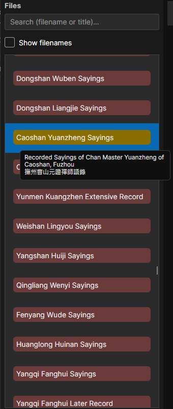
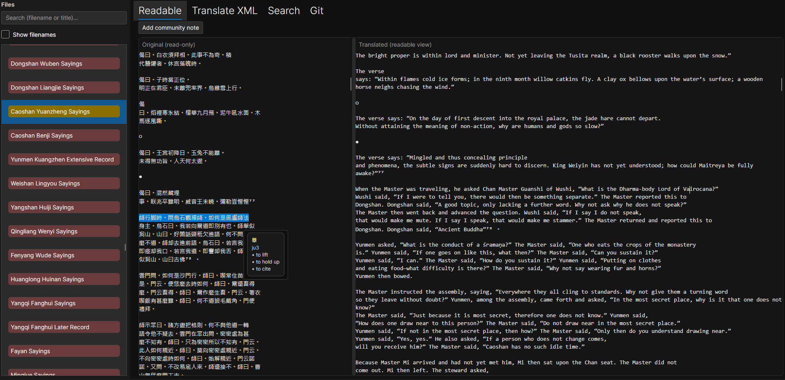
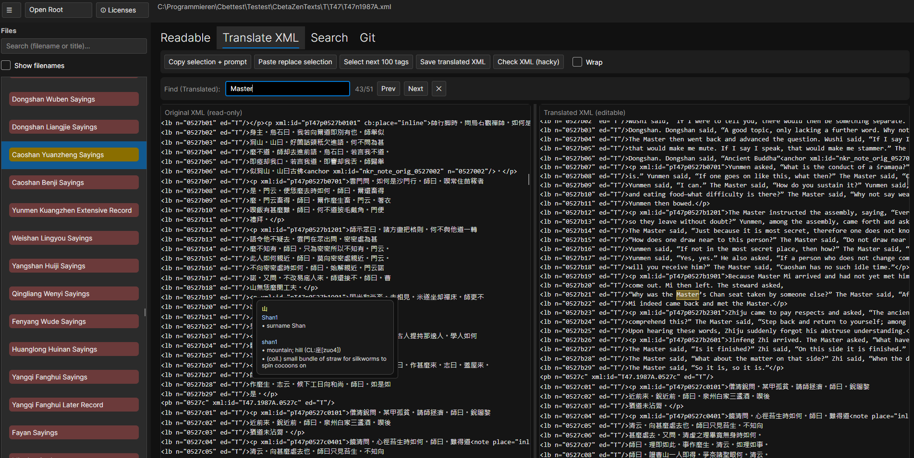
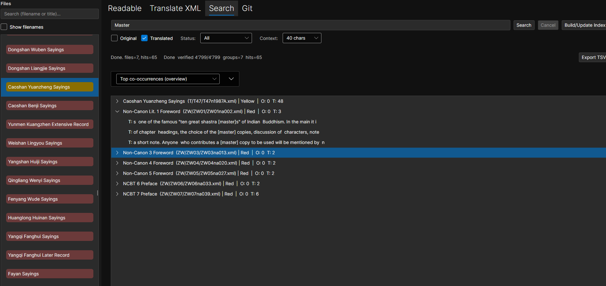
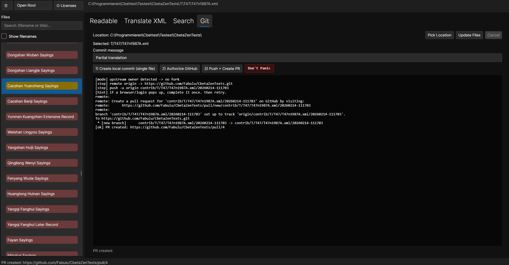

# CBETA Translator  
*A high-performance, cross-platform corpus editor for the CBETA XML-P5 canon*

> Translate. Render. Annotate. Search. Commit.  
> All without breaking XML. All without breaking history.

---

## 📌 What Is This?

**CBETA Translator** is a desktop application built with **Avalonia UI (.NET 8)** for working with the **CBETA XML-P5 corpus** — especially Chan/Zen texts.

It is designed for:

- Serious corpus-scale XML handling  
- Community translation workflows  
- Git-based contribution  
- Cross-platform desktop usage (Windows + Linux)  
- High performance even with very large XML files  

This is not a toy editor.  
This is a full corpus environment.

---

# 📂 Corpus Navigation (Left Sidebar)



Select a **root folder** containing:

```
root/
  xml-p5/    (original Chinese XML)
  xml-p5t/   (translated XML)
```

The app automatically:

- Indexes the corpus  
- Tracks translation status  
- Matches original and translated files  
- Caches index data for performance  

### 🌈 Translation Status Coloring

The file system view visually shows translation state:

| Color | Meaning |
|-------|---------|
| 🔴 Red | Not translated |
| 🟡 Yellow | Partially translated |
| 🟢 Green | Fully translated |

Filtering is **instant**.  
Search within the file tree is **hyper fast**.

---

# 📖 Readable Tab



The **Readable** tab renders TEI XML into a clean side-by-side document view.

### Layout

| Left Side | Right Side |
|------------|-------------|
| Chinese (original) | English (translated) |

If no translation exists yet:

- You will see **Chinese on both sides**.

---

## 🔁 Bidirectional Segment Mapping

When you:

- Select English text → the corresponding Chinese segment highlights.  
- Select Chinese text → the English segment highlights.  
- Move caret → mapping stays correct.  

This is powered by:

- Segment-level rendering  
- Index-aware mapping  
- XML-safe position nudging  

Even large documents remain responsive. If they don't it's a bug. Come and annoy me on the forums.

---

## 📝 Community Footnotes

You can insert structured community notes directly into the translated XML:

```xml
<note type="community" resp="optional">Text</note>
```

Features:

- Caret → XML index mapping  
- Tag-safe insertion  
- Strict deletion validation  
- Re-render on save  
- Cache invalidation handled automatically  

Notes are persisted directly inside the XML structure.

Sounds like gibberish? It'll just look like footnotes in a text.

---

## 🔍 Local Search (Ctrl + F)

All views support local search:

- File system filter  
- Readable view search  
- Translation XML view search  

Search go fast. Vroom Vroom.

---

# 🧠 Translation XML View



A structured XML editing environment for the translated document.

Purpose:

- Machine translation assistance  
- Manual correction  
- Preserve XML tags  
- Avoid structural corruption  

### Features

- Raw XML editing  
- Save triggers:
  - File write  
  - Render cache invalidation  
  - Translation status recompute  
  - Re-render  
- Ctrl + F search inside XML  
- XML integrity preserved  

---

# 🚀 Super Search (Corpus-Wide)



The **Search Tab** scans the entire CBETA corpus.

It provides:

- Full-text search  
- File matches  
- Metadata display  
- Quick open navigation  
- Corpus statistics  

### ⚡ Speed

Search is powered by:

- Index caching  
- Bloom filter acceleration  

Initial index build may take a while.  
Be patient. It’s building something massive.

After that?

Search is lightning fast.

---

# 🧮 Statistics

The search system can display:

- Match counts  
- File counts  
- Distribution insights  
- Translation coverage metrics  

Honestly the search statistics feature is pretty half baked. If anybody uses it for anything, please tell me. I'll be glad to upgrade the features if people actually know what to do with them. At the moment I think nobody will see the difference between what I did and what it should actually look like if done competently.

---

# 🔗 Git Tab – Contribution Without Pain



The Git tab integrates full repository workflows directly into the app.

### Clone with One Click

- Press clone  
- Select repository  
- App creates the project root  
- No manual folder setup required  

Users don’t need to understand Git internals.

---

## 🧾 Single-File Contribution Flow

Users can:

- Edit one translation file  
- Enter a commit message  
- Press commit  

Behind the scenes, the app:

- Forks the GitHub repository  
- Commits only the selected file  
- Pushes to the fork  
- Opens a Pull Request automatically  

To the user?

It feels like “Save and Submit”.

---

## 🔄 Update

The Git tab also supports:

- Pull latest changes  
- Sync local repo  
- Maintain clean working state  

No command line required.

---

# 🧱 Performance Architecture

This application is designed for large XML corpora.

### Index Cache

- Stored via `IndexCacheService`  
- Avoids full re-index on every launch  

### Render Cache

- `RenderedDocumentCacheService`  
- LRU-style caching  
- Keyed by file stamp (mtime + length)  

### Invalidation Rules

Triggered when:

- Root changes  
- File saved  
- Translation updated  

No unnecessary re-rendering.

---

# 🖥 Platform Support

- Windows (self-contained binary)  
- Linux (WSL-tested)  
- Cross-platform via Avalonia 11.3.11
- If someone wants to help me make a Mac build I'm all ears! (I don't have a Mac, all you need is a Mac and some time on a video call with me! Or if you know how to do it yourslf just send me the file!) 

---

# 🎯 Long-Term Vision

- Open-source CBETA translation environment  
- Community note system  
- Git-based collaborative translation  
- Cross-platform distribution  
- High-performance XML rendering  
- Clean GitHub-based contribution model  

---

# 🛠 Building

### Windows (Self-Contained)

```
dotnet publish -c Release -r win-x64 --self-contained true /p:PublishSingleFile=true
```

### Linux

```
dotnet publish -c Release -r linux-x64 --self-contained true
```

### macOS (Intel)

```
dotnet publish -c Release -r osx-x64 --self-contained true /p:PublishSingleFile=true
```

### macOS (Apple Silicon / M1–M3)

```
dotnet publish -c Release -r osx-arm64 --self-contained true /p:PublishSingleFile=true
```

# 📦 Important: Dictionary Asset

The application requires:

```
Assets/Dict/cedict_ts.u8
```

If building manually, verify that the dictionary exists in the publish folder:

```
bin/Release/net8.0/<runtime>/publish/Assets/Dict/cedict_ts.u8
```

If it is missing, copy it manually:

```
cp -r Assets/Dict bin/Release/net8.0/<runtime>/publish/Assets/
```

(Windows PowerShell:)

```
Copy-Item -Recurse Assets\Dict bin\Release\net8.0\<runtime>\publish\Assets\
```

---

# Final Words

CBETA Translator is:

- A serious corpus-scale XML editor  
- A collaborative translation platform  
- A Git-integrated contribution engine  
- A high-performance renderer  

Built for reddit by yours truly, hello /r/zen!

This is dota2nub

🦇 Welcome to the canon.
